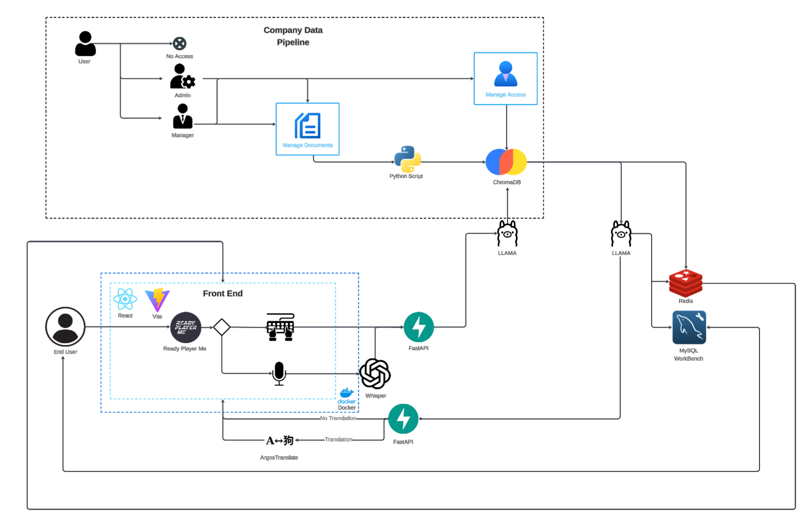

# System Architecture
  
The system is composed of these primary services that communicate internally:



## Summarised Key Flows

```plaintext
1. User Interaction
   User → React + Vite → Prompt → FastAPI → LLaMA → ChromaDB → LLaMA → Response → FastAPI → React + Vite → User

2. File Upload by Manager/Admin
   Manager/Admin → Upload File → Processing Pipeline → ChromaDB

3. User Actions Logging
   User → Perform Action → Log Event → MySQL

4. Authentication Flow
   User Login → MySQL (Persistent Logging) → Redis (Session Cache)

5. Optional Features
   a. Speech-to-Text:  
      User → Microphone Input → Whisper → Text Prompt

   b. Translation of Replies:  
      Response → ArgosTranslate → Translated Response → User
```
